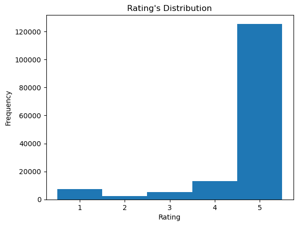
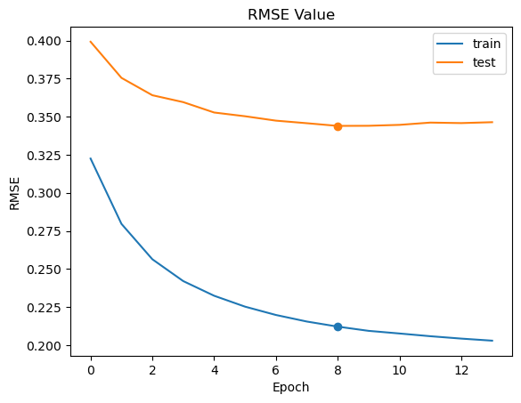
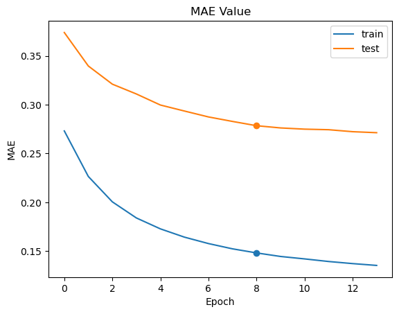

# Laporan Proyek Machine Learning - Aria Wahyu Wicaksono
_Recommender system_ dengan menggunakan _content-based filtering_ dan _collaborative filtering_.

- Nama: Aria Wahyu Wicaksono
- Email: wicaksonoariawahyu@gmail.com
- Username: aria_wahyu_w

## Project Overview

_E-commerce_ atau _electronic commerce_ merupakan salah satu akibat dari perkembangan teknologi terhadap kegiatan perbelanjaan.  _E-commerce_ membuat kegiatan transaksi dapat dilakukan secara digital. Indonesia berada di peringkat 10 besar pasar _e-commerce_ terbesar di dunia pada tahun 2023, dengan _revenue_ sebesar US$52.930,1 juta. Dengan perkembangan yang diekspektasi sebesar 11,3% pada tahun 2023, transaksi _e-commerce_ global diekspektasikan meningkat untuk tahun berikutnya [1]. Oleh karena itu, pengembangan _e-commerce_ menjadi salah satu hal yang perlu diperhatikan oleh pelaku usaha. Studi terkait sistem rekomendasi memberikan bukti empirik bahwa sistem rekomendasi memberikan pengaruh secara langsung terhadap terstimulasinya pembelian impulsif [2]. Secara praktikal, studi tersebut merekomendasikan pengembangan sistem rekomendasi yang jelas, ringkas, dan efisien dibandingkan hanya berfokus pada desain situs web yang menarik. Contoh aplikasi sistem rekomendasi pada aplikasi _e-commerce_ di antaranya: rekomendasi barang yang mirip atau terkait, rekomendasi barang yang terjual paling banyak, dan rekomendasi barang pilihan untuk pengguna.

## Business Understanding

### Problem Statements
- Bagaimana rancangan sistem rekomendasi untuk menghasilkan rekomendasi barang berdasarkan kesamaan barang yang terkait?

- Bagaimana rancangan sistem rekomendasi untuk menghasilkan rekomendasi barang berdasarkan barang yang telah dibeli? Bagaimana performa model yang dirancang pada data validasi?

### Goals

- Merancang sistem rekomendasi untuk merekomendasikan barang berdasarkan kesamaan terhadap barang yang dipilih.

- Merancang sistem rekomendasi untuk merekomendasikan barang-barang unik yang belum dibeli berdasarkan barang yang telah dibeli  dan mengevaluasi sistem rekomendasi berdasarkan metrik evaluasi.

### Solution Statements
- Merancang model _content-based filtering_ yang merekomendasikan barang-barang yang cenderung mirip (berdasarkan nilai kesamaan barang) terhadap barang yang dipilih. Perhitungan nilai kesamaan barang dapat menggunakan nilai _cosine similarity_.

- Merancang model _collaborative filtering_ yang merekomendasikan barang-barang yang diprediksi akan disukai pengguna berdasarkan barang-barang yang telah dibeli pengguna sebelumnya. Metrik evaluasi yang dapat digunakan adalah _root mean squared error_ (RMSE).

## Data Understanding

Dataset yang digunakan adalah dataset [Lazada Indonesian Review](https://www.kaggle.com/datasets/grikomsn/lazada-indonesian-reviews) dari Kaggle. 

Dataset terbagi menjadi dua dataset, yaitu dataset _items_ dan _reviews_. Dataset _items_ (`df_items`) terdiri dari:
- `itemID`: ID unik barang
- `category`: kategori barang (beli-harddisk-eksternal, beli-laptop, beli-smart-tv, jual-flash-drives, shop-televisi-digital)
- `name`: nama atau judul barang
- `brandName`: nama _brand_ barang
- `url`: alamat laman web barang
- `price`: harga barang dalam rupiah
- `averageRating`: rata-rata nilai penilaian barang
- `totalReviews`: jumlah _review_ yang diterima barang
- `retrievedDate`: tanggal data barang diterima/diambil

Dataset _reviews_ (`df_users`) terdiri dari:
- `itemID`: ID unik barang
- `category`: kategori barang (beli-harddisk-eksternal, beli-laptop, beli-smart-tv, jual-flash-drives, shop-televisi-digital)
- `name`: nama pengguna
- `rating`: nilai penilaian terbaru pengguna
- `originalRating`: nilai penilaian pengguna sebelumnya
- `reviewTitle` : judul _review_ pengguna
- `reviewContent`: isi _review_ pengguna
- `likeCount`: jumlah pengguna yang menyukai hasil _review_
- `upVotes`: jumlah pengguna yang meng-_upvote_ _review_
- `downVotes`: jumlah pengguna yang meng-_downvote_ _review_
- `helpful`: jumlah pengguna yang menganggap hasil _review_ membantu
- `relevanceScore`: nilai relevansi _review_ terhadap produk
- `boughtDate`: tanggal pembelian barang
- `clientType`: jenis perangkat yang digunakan pengguna
- `retrievedDate`:tanggal data _review_ diterima/diambil

### Data _Missing_ dan Duplikat

Dataset `df_items` dimodifikasi sehingga menjadi memiliki `itemId` yang bernilai unik untuk tiap barisnya. Hal ini disebabkan dataset tersebut akan digunakan untuk rekomendasi barang, sehingga diharapkan tidak memiliki barang duplikat. Data bernilai NaN dihapus dari dataset `df_users` pada subset kolom `itemId`, `name`, dan `rating`. Data NaN hanya dihapus pada kolom tersebut, karena kolom tersebut saja yang akan digunakan untuk pembuatan model. Akun tamu (Lazada Customer dan Lazada Guest) tidak digunakan pada pelatihan model, karena diharapkan akun pengguna bersifat unik.

Setelah proses pembersihan, jumlah total data pada tiap dataset adalah sebagai berikut:
- Dataset _review_  sebanyak 4422 data
- Dataset _item_ sebanyak 153593 data

Berikut adalah tampilan dataset _review_ dan dataset _item_.

Tabel 1. Dataset _review_ (`df_users`)
|itemId | 	category | 	name | 	rating  |	originalRating | 	reviewTitle | 	reviewContent | 	likeCount |	upVotes |	downVotes |	helpful |	relevanceScore | 	boughtDate | 	clientType | 	retrievedDate | 	old_name |
|-|-|-|-|-|-|-|-|-|-|-|-|-|-|-|-|
|0 | 	100002528 |	beli-harddisk-eksternal |	kamal u |	5 |	NaN |	NaN |	bagus mantap dah sesui pesanan | 	0 |	0 |	0 |	True |	26.51 |	09 Apr 2019 |	androidApp |	2019-10-02 |	Kamal U.|
|1| 	100002528 |	beli-harddisk-eksternal |	yofanca m |	4 |	NaN | 	NaN | 	Bagus, sesuai foto | 	0 |	0 |	0 |	True | 	22.49  |	24 Sep 2017 |	androidApp | 	2019-10-02 | 	yofanca m. |
|4 |	100002528 |	beli-harddisk-eksternal |	yosep m |	5 |	NaN |	NaN | 	NaN |	0 |	0 |	0 |	True |	16.01 |	17 Agu 2018 |	androidApp | 	2019-10-02 | 	Yosep M. |
|5 | 	100002528 |	beli-harddisk-eksternal |	deden |	5 |	NaN |	NaN | 	NaN |	0 | 	0 |	0 |	True |	16.01 |	02 Nov 2017 |	androidApp | 	2019-10-02 |	Deden |
|6 |	100002528 |	beli-harddisk-eksternal |	yeana |	5 |	NaN |	NaN |	NaN |	0 |	0 |	0 |	True |	13.01 |	25 Sep 2017 |	mobile |	2019-10-02 | 	Yeana |

Tabel 2. Dataset _item_ (`df_items`)
|itemId| 	category| 	name| 	brandName| 	url| 	price| 	averageRating| 	totalReviews| 	retrievedDate|
|-|-|-|-|-|-|-|-|-|
|0| 	100002528| 	beli-harddisk-eksternal| 	TOSHIBA Smart HD LED TV 32" - 32L5650VJ Free B...| 	Toshiba| 	https://www.lazada.co.id/products/toshiba-smar...| 	2499000| 	4 |	8 |	2019-10-02|
|1 	|100003785 |	beli-harddisk-eksternal | 	TOSHIBA Full HD Smart LED TV 40" - 40L5650VJ -... |	Toshiba |	https://www.lazada.co.id/products/toshiba-full... |	3788000 |	3 |	3 |	2019-10-02 |
|2 |	100004132  |	beli-harddisk-eksternal |	Samsung 40 Inch Full HD Flat LED Digital TV 4... | 	LG | 	https://www.lazada.co.id/products/samsung-40-i... |	3850000 |	3 |	2 |	2019-10-02 |
|3 |	100004505 | 	beli-harddisk-eksternal | 	Sharp HD LED TV 24" - LC-24LE175I - Hitam | 	Sharp |	https://www.lazada.co.id/products/sharp-hd-led... |	1275000 |	3 |	11 |	2019-10-02 |
|4 	| 100005037 |	beli-harddisk-eksternal |	Lenovo Ideapad 130-15AST LAPTOP MULTIMEDIA I A... |	Lenovo | 	https://www.lazada.co.id/products/lenovo-ideap... |	3984100 |	5 | 	1  |	2019-10-02 |

Keterangan: Dataset _review_ masih memiliki nilai NaN, namun hanya pada kolom yang tidak akan menjadi fokus (tidak digunakan) pada pembuatan model, sehingga dapat diabaikan.

### Analisis Univariat pada Variabel _Rating_ pada Dataset _Review_

Variabel _rating_ pada dataset _review_ memiliki data sejumlah 153593 data, dengan:
- Rata-ratanya bernilai 4,610607
- Kuartil satu, dua, dan tiga bernilai 5

Hal ini menunjukkan bahwa kebanyakan _rating_ bernilai 5 bintang. Hal ini juga ditunjukkan pada distribusi _rating_ pada plot histogram yang ditunjukkan gambar 1 berikut.

Gambar 1. Distribusi _Rating_ pada Dataset _Review_.

## Data Preparation

### Encoding User ID dan Item ID

Pada bagian ini, `UserId` dan `name` pada dataset _review_ diubah menjadi _integer_ dalam _range_ [0, jumlah data]. Hal ini bertujuan agar data menjadi bertipe numerik dan berurutan secara numerik, sebelum dilakukan proses _embedding_. _Encoder_ dan _decoder_ bertipe _dictionary_ agar mudah untuk melakukan konversi data. Selain itu, ditambahkan _dictionary_ `item_id_to_name` untuk mengkonversi `itemId` menjadi nama barang.

_Encoder_ _item_ dan _user_ kemudian diaplikasikan ke kolom `itemId` dan `name` pada dataset _review_ (`df_users`). Berikut adalah contoh hasil proses _encode_ untuk beberapa baris data.

Tabel 3. Hasil _encode_ beberapa baris data
| | item | user |
|-|-|-|
|0|0|0|
|1|0|1|
|4|0|2|
|5|0|3|
|6|0|4|
|7|0|5|
|8|1|6|
|9|1|7|
|10|1|8|
|12|2|9|

### Data Splitting dan Balancing

Dataset _review_ yang akan digunakan pada model _collaborative filtering_ hanya kolom `user` dan `item` sebagai fitur, serta `rating` sebagai target. Untuk proses pelatihan dataset tersebut dibagi menjadi 80% data untuk pelatihan dan 20% untuk proses validasi.

Tabel 4. Data _rating_ untuk pelatihan 
|_Rating_ |Jumlah |
|---|---|
| &#9733;&#9734;&#9734;&#9734;&#9734; | 5796 |
| &#9733;&#9733;&#9734;&#9734;&#9734; | 1944 |
| &#9733;&#9733;&#9733;&#9734;&#9734; | 4211 |
| &#9733;&#9733;&#9733;&#9733;&#9734; | 10526 |
| &#9733;&#9733;&#9733;&#9733;&#9733; | 100397|

Nampak pada tabel 4 bahwa data _rating_ tidak seimbang. Oleh karena itu, digunakan metode SMOTE-ENN. Metode SMOTE-ENN merupakan gabungan dari metode SMOTE dan ENN. Metode SMOTE (_Synthetic Minority Oversampling Technique_) merupakan metode _oversampling_ dengan menambahkan data sintesis menggunakan _nearest neighbours_ tiap sampel [3]. Metode ENN (_Edited Nearest Neighbours_) merupakan modifikasi dari metode _nearest neighbor rule_ untuk kasus _undersampling_, dimana sampel kelas mayoritas dihapus dengan menggunakan aturan tiga tetangga terdekat kemudian diaplikasikan pada aturan satu tetangga terdekat [4]. 
Gabungan metode SMOTE dengan ENN yang diaplikasikan pada data _rating_ pelatihan menghasilkan distribusi data seperti pada tabel 5 berikut.

Tabel 5. Data _rating_ untuk pelatihan setelah menggunakan metode SMOTE-ENN
|_Rating_ |Jumlah |
|---|---|
| &#9733;&#9734;&#9734;&#9734;&#9734; | 73007 |
| &#9733;&#9733;&#9734;&#9734;&#9734; | 65618 |
| &#9733;&#9733;&#9733;&#9734;&#9734; | 60688 |
| &#9733;&#9733;&#9733;&#9733;&#9734; | 57104 |
| &#9733;&#9733;&#9733;&#9733;&#9733; | 54928|

### Normalisasi Data

Data _rating_ pelatihan dan validasi kemudian dinormalisasi sehingga menjadi berada di rentang [0, 1]. Tujuan normalisasi adalah agar rentang data tidak terlalu besar, karena rentang data yang terlalu besar dapat menyulitkan proses pelatihan.

### _Text Preprocessing_

Pada proses ini, teks judul barang pada variabel `name` diubah dengan aturan:
- membuat judul menjadi dalam huruf kecil
- menghapus tanda baca pada judul
- menghapus spasi pada awal dan akhir judul
- mengubah jumlah spasi menjadi hanya satu spasi
- menghapus _stop word_ pada judul

Tujuan proses pembersihan teks ini adalah untuk mereduksi kompleksitas dan kata unik pada seluruh teks di dataset.

## Modeling

### Model 1. Model _Content Based Filtering_

Operasi vektorisasi TF-IDF merupakan operasi gabungan antara _term frequency_ dan _inverse document frequency_. Gabungan dari kedua operasi tersebut berfungsi untuk menemukan kata-kata penting atau representasi fitur penting. Operasi ini menghasilkan matriks _document-term_. 
Operasi vektorisasi TF-IDF diaplikasikan pada data variabel `name` yang telah dibersihkan. 
Hasil vektorisasi kemudian dihitung kesamaan antar datanya dengan menggunakan fungsi _cosine similarity_. Fungsi ini akan mengukur kesamaan antar vektor data berdasarkan nilai cosinus sudut vektor data. Data dengan kesamaan terbesar (kecuali data yang sama) dipilih sebanyak N buah. 

Berikut adalah hasil _top 5 recommendation_ dari sistem rekomendasi _content based filtering_:

Tabel 6. Hasil rekomendasi dari sistem rekomendasi _content based filtering_

| | Items similar to Seagate Expansion Portable Drive 2TB 2.5" USB 3.0 HDD/ Hardisk/ Harddisk External/ Hard Drive :          |
|--|-------------------------------------------------------|
|1.|Seagate Expansion Portable 2TB 2.5" USB 3.0 HDD/ Hardisk/ Harddisk External/ Hard Drive - Hitam|
|2. |Seagate Expansion Portable Drive 1TB 2.5" USB 3.0 HDD/ Hardisk/ Harddisk External/ Hard Drive|
|3. |Seagate Expansion Portable Drive 500GB 2.5" USB 3.0 HDD/ Hardisk/ Harddisk External/ Hard Drive|
|4. |Seagate Expansion Portable Drive 4TB 2.5" USB 3.0 HDD/ Hardisk/ Harddisk External/ Hard Drive|
|5. |Seagate Expansion Portable 1TB 2.5" USB 3.0 HDD/ Hardisk/ Harddisk External/ Hard Drive - Hitam|

Kelebihan model ini adalah dapat memberikan rekomendasi tanpa harus menggunakan data pengguna (untuk masalah privasi). Namun, rekomendasi yang diberikan berdasarkan kesamaan barang, bukan berdasarkan preferensi pengguna, sehingga hasil rekomendasi mungkin tidak sesuai dengan keinginan pengguna.

###  Model 2. Model _Collaborative Filtering_

Model _collaborative filtering_ dibuat dengan besar _embbeding_ sebesar 64, inisialisasi _layer embedding_ denggan menggunakan fungsi _random normal_, dan dengan regularisasi l2 dengan besar penalti $10^{-5}$. _Layer embedding_ dengan spesifikasi tersebut digunakan untuk proses _embedding_ pada data _user_ dan _item_. Kedua hasil keluaran _embedding_ kemudian dikalikan dengan operasi _dot product_, kemudian dipetakan dengan fungsi sigmoid.

Proses pelatihan menggunakan fungsi _loss_ _binary crossentropy_, fungsi optimasi Adam, dan ditambahkan metrik evaluasi RMSE.

Berikut adalah barang-barang yang telah dibeli Denny sebelumnya:

Tabel 7. Barang-barang yang telah dibeli pengguna

|  | Item bought by Denny                                    |
|--| --------------------------------------------------------|
|1.| ORICO 2139U3 Enclosure HDD/SSD 2.5" USB3.0 - Transparent Garansi Resmi 1 Tahun|
|2. | SanDisk CZ50 Cruzer Blade USB 2.0 - 32 GB - Hitam|
|3. |  WD My Passport New Design 1TB/2.5Inch/USB3.0 - Merah + Free Pouch + Pen|
|4. |  WD My Passport New Design 1TB/2.5Inch/USB3.0 - Putih + Free Pouch + Pen|
|5. | Dell Inspiron 3180 RESMI ( AMD A9 - 9420  4GB DDR4  500GB  WIN10  11 HD )|
|6. |  [GRATIS ONGKIR] Samsung HD TV 24 inch (model: 24H4150 Series 4)|
|7. |  SanDisk Flashdisk Cruzer Blade CZ50 - 16GB|
|8. |  EsoGoal Pengisian Station Tas Hardisk Eksternal Dual Bay HDD Docking Station, External Hard Drive Base Box SATA to USB 3.0 Adapter for 2.5 3.5 HDD SSD External Hard Drive Disk Case with UASP Protocol 2 x 8TB Supported|
|9. |  [GRATIS ONGKIR] Samsung Full HD TV 40 inch (Model 40N5000)|
|10. |  Asus X441MA-GA011T - Intel® Celeron® N4000 - RAM 4GB - 1Tb - 14" - W10 - Black - Laptop Murah (Gratis Tas) - Bergaransi|
|11. | Special Promo!! Case harddisk Hard Case Shockproof Tas Hardisk / Powerbank  Softcase Tahan Banting for External HDD 2.5 inch Pouch Bag Flash Sale|
|12. |  [GRATIS ONGKIR][Android 9.0 Ready] Xiaomi LED TV 43 inch - Smart TV Android Certified - PatchWall 2.0 (Model : 4A43)|
|13. | ORICO 2.5 inch HDD/SSD Enclosure USB 3.0 - 2189U3 - Black|
|14. |  Eksternal Hard Disk Drive 2.5 "Portable USB3.0 HDD Penyimpanan untuk PC MAC Desktopxbox Satu Xbox 360 PS4|

Berikut adalah hasil _top 5 recommendation_ dari sistem rekomendasi _collaborative filtering_:

Tabel 8. Hasil rekomendasi dari sistem rekomendasi _content based filtering_

| | Recommendation for Denny                               |
|--|-------------------------------------------------------|
|1.| Lenovo Thinkpad 11E-5V00 Quad Core N2940 - 4GB - 500GB - Windows 10 PRO|
|2.| Acer E5-476G-56VN - Intel core i5-8250U - 4GB - 1TB -Nvidia geforce Mx150 - 14  - ODD - W10 - Silver - Laptop Murah (Gratis Tas) - Bergaransi|
|3.| Samsung BAR Plus USB 3.1 Flash Drive 32GB - Hitam|
|4.| flashdisk hp 32gb / flasdisk hp 32gb / flash disk hp 32gb/usb|
|5.| Flashdisk 16 GB Kingston Flashdisk Data Traveler [BMS 1212]|

Tabel 9. _Rating_ untuk tiap hasil rekomendasi

|Rekomendasi ke- |Rating |
|-|---|
|1. |  4,895483 |
|2. |  4,899954 |
|3. |  4,9054146 |
|4. |  4,927363 |
|5. |  4,9499083 |

Kelebihan dari model _collaborative filtering_ adalah hasil rekomendasi barang diperoleh berdasarkan pembelian barang sebelumnya, sehingga hasil rekomendasi yang diperoleh cenderung mengikuti preferensi pengguna. Kelemahan dari model ini adalah apabila pengguna belum membeli produk apapun, maka sistem rekomendasi akan mengalami kesulitan dalam memberikan rekomendasi yang baik. Permasalahan ini biasa dikenal sebagai _cold start problem_.

## Evaluation

### Model _Content-Based Filtering_

Metrik evaluasi yang digunakan pada model _content-based filtering_ adalah similaritas cosinus (_cosine similarity_). Similaritas cosinus mengukur perbedaan cosinus sudut antara dua vektor. Berikut adalah formula dari similaritas cosinus:

$$ sim(x,y)= \frac{{\mathbf{x} \cdot \mathbf{y}}}{{\|\mathbf{x}\| \cdot \|\mathbf{y}\|}} $$

dimana:
- $\mathbf{x} = (x_1, x_2, ..., x_p)$ adalah vektor pertama
- $\mathbf{y} = (y_1, y_2, ..., y_p)$ adalah vektor kedua
- $\|\mathbf{x}\|$ adalah _euclidean norm_ vektor $\mathbf{x}$
- $\|\mathbf{y}\|$ adalah _euclidean norm_ vektor $\mathbf{y}$

Nilai $sim(x,y)$ berada di rentang nol hingga satu, dengan nilai nol menunjukkan kedua vektor saling tegak lurus (tidak sama) dan nilai satu menunjukkan kedua vektor merupakan vektor yang sama [5].

Pada proyek ini, vektor yang digunakan adalah vektor hasil dari vektorisasi TF-IDF pada data judul barang di dataset _items_. 

Berikut adalah nilai similaritas cosinus dari tiap hasil rekomendasi _content-based filtering_ pada __tabel 6__.

Tabel 10. Nilai similaritas cosinus hasil rekomendasi _content-based filtering_
|Rekomendasi ke- | Similaritas cosinus |
|-|---|
|1.| 0,9549566791215383 |
|2.| 0,9277813552501742 |
|3.| 0,907377269924378 |
|4.| 0,888086706028696 |
|5.| 0,8801537980668251 |

Nampak bahwa seluruh hasil rekomendasi memiliki nilai similaritas cosinus mendekati nilai satu terhadap data masukan. Hal ini menunjukkan bahwa hasil rekomendasi memiliki kesamaan yang cukup tinggi terhadap data masukan.

### Model _Collaborative Filtering_

Metrik evaluasi pertama yang digunakan adalah **_root mean squared error_**. _Root mean squared error_ menghitung akar dari nilai rata-rata kuadrat antara selisih nilai prediksi dengan nilai aktual. _Root mean squared error_ dapat digunakan untuk kasus analisis regresi non-linear, sehingga cocok digunakan untuk sebagai perhitungan galat pada proyek ini. Berikut adalah formula dari _root mean squared error_:

$$RMSE = \sqrt{\frac{1}{n}\sum_{i=1}^{n}(y_i - \hat{y_i})^2}$$

dimana:
- n adalah banyak data observasi,
- $y_i$ adalah nilai aktual target untuk observasi data ke- $i$,
- $\hat{y_i}$ adalah nilai prediksi target untuk observasi data ke- $i$.

Metrik evaluasi kedua yang digunakan adalah **_mean absolute error_**. Formula tersebut diaplikasikan pada keluaran dari fungsi _sigmoid_ pada model `Recommender` terhadap nilai _rating_ aktual data pelatihan. _Mean absolute error_ menghitung nilai absolut dari selisih nilai prediksi dengan nilai aktual. _Mean absolute error_ dapat digunakan untuk kasus analisis regresi non-linear, sehingga cocok digunakan untuk sebagai perhitungan galat pada proyek ini. Berikut adalah formula dari _mean absolute error_:

$$MAE = \frac{1}{n}\sum_{i=1}^{n}|y_i - \hat{y_i}|$$

dimana:
- n adalah banyak data observasi,
- $y_i$ adalah nilai aktual target untuk observasi data ke- $i$,
- $\hat{y_i}$ adalah nilai prediksi target untuk observasi data ke- $i$.

Berikut adalah berturut-turut plot nilai _loss_ RMSE dan MAE terhadap banyak _epoch_

Gambar 2. Plot nilai _loss_ RMSE pada model _collaborative filtering_

Gambar 3. Plot nilai _loss_ MAE pada model _collaborative filtering_

Titik berwarna jingga dan biru pada plot merupakan nilai _loss_ untuk _epoch_ terbaik berdasarkan fungsi _callback_ yang me-_monitor_ nilai RMSE data _test_ atau validasi. Nilai RMSE untuk data pelatihan sebesar 0,21216611564159393 dan untuk data _test_ atau validasi sebesar 0,3439439535140991. Sedangkan nilai MAE untuk data pelatihan sebesar 0,1480945646762848 dan untuk data _test_ atau validasi sebesar 0,2785094380378723

Nampak bahwa nilai RMSE dan MAE untuk data pelatihan dan validasi cukup kecil jika dibandingkan terhadap selisih 1 bintang, sehingga sistem rekomendasi dapat memberikan hasil rekomendasi yang cukup akurat.

## Kesimpulan

- Sistem rekomendasi untuk merekomendasikan barang berdasarkan kesamaan terhadap barang yang dipilih adalah dengan menggunakan model _content-based filtering_. Berdasarkan hasil evaluasi pada tabel 7, model _content-based filtering_ memiliki similaritas cosinus di antara 0,88 dan 0,955. Nilai similaritas kosinus yang mendekati satu menunjukkan bahwa rekomendasi yang diberikan memiliki kesamaan yang tinggi terhadap data barang yang dipilih. Hasil rekomendasi untuk data uji ditunjukkan oleh tabel 6.

- Sistem rekomendasi untuk merekomendasikan barang-barang unik yang belum dibeli berdasarkan barang yang telah dibeli adalah dengan menggunakan model _collaborative filtering_. Berdasarkan hasil evaluasi, nilai RMSE untuk data pelatihan sebesar 0,21216611564159393 dan untuk data _test_ atau validasi sebesar 0,3439439535140991. Sedangkan nilai MAE untuk data pelatihan sebesar 0,1480945646762848 dan untuk data _test_ atau validasi sebesar 0,2785094380378723. Nilai RMSE dan MAE untuk data pelatihan dan validasi cukup kecil jika dibandingkan terhadap selisih 1 bintang, sehingga sistem rekomendasi dapat memberikan hasil rekomendasi yang cukup akurat.
Hasil rekomendasi untuk data uji ditunjukkan oleh tabel 8.

Daftar Pustaka:

[1] Anonim. eCommerce Market Indonesia - Data, Trends, Top Stores | ecommerceDB.com. https://ecommercedb.com/markets/id/all. Diakses pada: 7 Juni 2023.

[2] Z. Ying, C. Caixia, G. Wen and L. Xiaogang, "Impact of recommender systems on unplanned purchase behaviours in e-commerce," 2018 5th International Conference on Industrial Engineering and Applications (ICIEA), Singapore, 2018, pp. 21-30

[3] Chawla, N. V., Bowyer, K. W., Hall, L. O., & Kegelmeyer, W. P. (2002). SMOTE: Synthetic Minority Over-sampling Technique. In Journal of Artificial Intelligence Research (Vol. 16, pp. 321–357). AI Access Foundation.

[4] Wilson, D. L. (1972). Asymptotic Properties of Nearest Neighbor Rules Using Edited Data. In IEEE Transactions on Systems, Man, and Cybernetics: Vol. SMC-2 (Issue 3, pp. 408–421). Institute of Electrical and Electronics Engineers (IEEE).

[5] Han, J., Kamber, M., & Pei, J. (2012). Getting to Know Your Data. In Data Mining (pp. 39–82). Elsevier.

